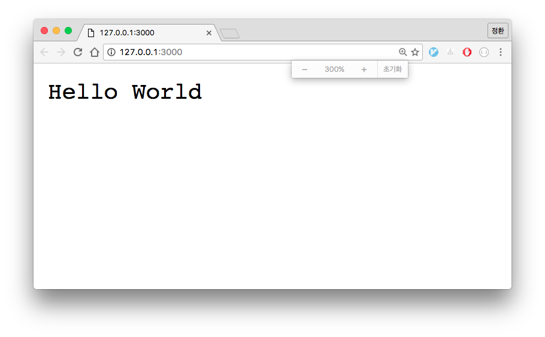

노드로 Hello World 만들기
=====================

모든 프로그래밍의 시작은 Hello world를 찍어보는 것에서부터 시작합니다. 노드도 거기서 부터 시작하겠습니다.

## 설치

노드 설치는 간단합니다. [nodejs.org](https://nodejs.org/ko/)에서 최신버전인 v6.x.x을 다운로드 하세요. 여러분이 사용하는 운영체제에 따라 노드 설치파일이 다운로드 될겁니다. 저는 OSX을 기준으로 진행할 겁니다.

다운로드한 설치파일을 실행하고 몇번 클릭하게되면 노드 설치가 완료됩니다.

노드가 설치 되었는지 확인해 볼까요? 유닉스 `which` 명령어로 노드 명령어의 위치를 확인해 봅시다.

```
which node
/usr/local/bin/node
```

운영체제에서 명령어를 모아두는 폴더인 /usr/local/bin 하위 폴더에 노드 명령어가 생성되었습니다. 그럼 처음으로 노드 명령어를 사용해 볼까요? 아래는 설치한 노드 버전을 출력하는 방법입니다.

```
node --version
v6.5.0
```

우리가 설치한 노드 버전이 v6.5.0이네요. 최신버전입니다.


## NPM

노드를 설치하면 npm 이라는 프로그램도 함께 설치됩니다. 이것은 노드로 만든 패키지를 관리하는 툴이고 Node Package Manager의 약자입니다. 우리는 npm의 몇 가지 기능을 이용해서 프로젝트를 진행할 겁니다. 우선 우리가 만들 프로젝트 폴더를 만들고 거기에 npm으로 프로젝트를 초기화 합니다.

```
mkdir codlab-nodejs
cd codlab-nodejs
npm init
```

몇 가지를 물어 볼건데요 그냥 엔터 입력하면서 기본값을 사용하다고 답변하면 됩니다. 모두 완료되면 package.json 이란 파일이 하나 생성됩니다. 이것은 프로젝트 정보를 기록한 파일인데요 npm으로 프로젝트를 관리하기 위해 사용됩니다. Npm으로 사용할 패키지를 추가할때 그 정보를 여기에 기록하거나 스크립트를 정의하여 실행할 수도 있습니다. 자세한 사용방법은 나중에 설명하고 지금은 헬로 월드를 찍어보는 것에 집중합시다.


## Hello world 웹서버

이제 우리는 [nodejs.org](https://nodejs.org/dist/latest-v6.x/docs/api/synopsis.html) 사이트로 이동합니다. 웹서버를 만들수 있는 간단한 코드를 제공하는데 이것을 복사하여 우리 프로젝트 폴더의 `app.js`라 파일로 만듭니다.

```javascript
const http = require('http');

const hostname = '127.0.0.1';
const port = 3000;

const server = http.createServer((req, res) => {
  res.statusCode = 200;
  res.setHeader('Content-Type', 'text/plain');
  res.end('Hello World\n');
});

server.listen(port, hostname, () => {
  console.log(`Server running at http://${hostname}:${port}/`);
});
```

코드에 대한 설명은 차후로 미룰께요. "Hello world" 문자열을 확인하는 것이 목적이니까요. 노드에서 자바스크립트로 만든 서버 어플리케이션을 실행하려면 `node` 명령어를 이용하면 됩니다. 아래처럼요.

```
node app.js
```

Npm을 이용해서 프로젝트를 관리할거라면 `package.json` 파일에 스크립트를 등록해 두는 것이 좋습니다. `start` 라는 스크립트를 만들어 보겠습니다.

```json
{
  "scripts": {
    "start": "node app.js"
  }
}
```

이제 `npm` 명령어로 서버 프로그램을 실행봅시다.

```
npm start
Server running at http://127.0.0.1:3000/
```

서버 프로그램이 실행되었고 우리는 http://127.0.0.1:3000 주소로 확인할 수 있습니다.


## 브라우져로 확인

크롬 브라우져을 열어 http://127.0.0.1:3000  주소로 접속해 보세요.



"Hello world" 문자열이 브라우져에 출력되었습니다!


## Curl로 리퀘스트 보내기

브라우져는 내부적으로 `GET http://127.0.0.1:3000` 요청을 보내서 그 결과를 화면에 뿌려주는 역할을 합니다. HTTP 요청은 이 외에도 헤더에 다양한 정보를 담아서 보낼수 있는데 브라우져는 모든 정보를 설정하기에는 기능이 제한적입니다.

구체적인 요청을 위해 앞으로는 `curl` 이란 프로그램을 사용할 겁니다. 아래 명령어로 다시 서버에 요청을 보내 보세요.

```
curl -X GET '127.0.0.1:3000'
Hello World
```

동일하게 "Hello world" 문자열이 출력되었습니다. 이번에는 -v 옵션을 추가해서 실행해 보세요.

```
curl -X GET 'localhost:3000' -v
* Rebuilt URL to: 127.0.0.1:3000/
*   Trying 127.0.0.1...
* Connected to 127.0.0.1 (127.0.0.1) port 3000 (#0)
> GET / HTTP/1.1
> Host: 127.0.0.1:3000
> User-Agent: curl/7.43.0
> Accept: */*
>
< HTTP/1.1 200 OK
< Content-Type: text/plain
< Date: Mon, 12 Sep 2016 03:02:44 GMT
< Connection: keep-alive
< Content-Length: 12
<
Hello World
* Connection #0 to host 127.0.0.1 left intact
```

좀더 상세한 정보들이 나옵니다. 눈에 띄는 정보가 있을지도 모르고 전혀 모르는 데이터일 수도 있습니다. 이 데이터에 대한 설명은 나중으로 미루겠습니다.

여기까지 노드를 이용한 Hello world 출력하기였습니다.


매 장마다 깃 태그를 이용해 코드를 볼수 있습니다. 이번 헬로월드 강의에 대한 코드는 helloWorld 태그를 이용하세요.

```
git checkout helloWorld
```

모든 대그를 보고 싶다면 아래 명령어로 확인하세요.

```
git tag -n
```
